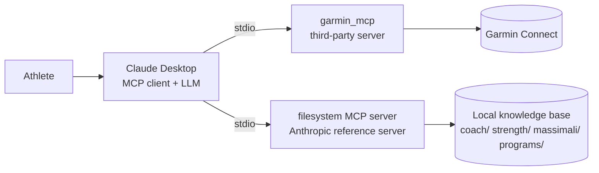

# Architecture

## Data flow for one planning request
1. The athlete pastes the planning prompt (`coach/prompt-nuova-programmazione.md`).
2. The model reads the knowledge base through the filesystem server: rules, athlete profile, medical constraints, running goal, history.
3. The model reads current recovery/training data through the Garmin server.
4. It produces a block plan and asks precise questions if key information is missing.
5. The athlete logs real sessions back as JSON files in `strength/`.

## Trust boundaries (relevant for the later security analysis)
| Component | Trust | Why it matters |
|---|---|---|
| Rule / constraint files | Treated as **instructions** by the model | A modified file changes agent behaviour (context poisoning) |
| Garmin data | External data | Free-text fields (activity names/notes) are attacker-influenceable if an account is shared or synced |
| Garmin server | Third-party code, run via `uvx` | Supply-chain risk; pin a commit |
| Filesystem server | Local, path-scoped | Scope to the training-log folder only |
| Token directory | Grants access to the Garmin account | Keep outside the repo and outside the filesystem server's scope |
